# 2.1 HTTP协议是个什么？

用于客户端和服务端之间通信的一个协议

# 2.2 怎么样利用HTTP进行通信的？

通过请求和响应的交换达成通信。


+ 客户端发送了请求，服务端才能发送响应。没有请求，肯定就没有响应。

## 2.2.1 这个请求长什么样？

请求报文由请求方法，请求URI，协议版本，可选的**请求首部字段**和内容实体

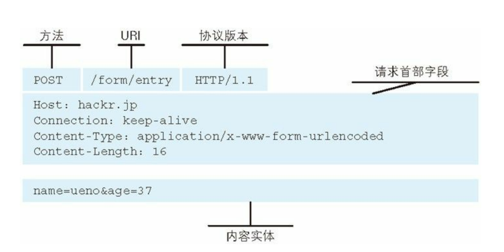

举个例子说明：

```HTTP
GET /index.htm HTTP/1.1
Host:hackr.jp
```

这段请求的意思是：请求某台HTTP服务器上的index.htm页面资源

## 2.2.2 响应报文长什么样？

响应报文由 协议版本，状态码，原因短语，可选的响应首部字段，内容实体

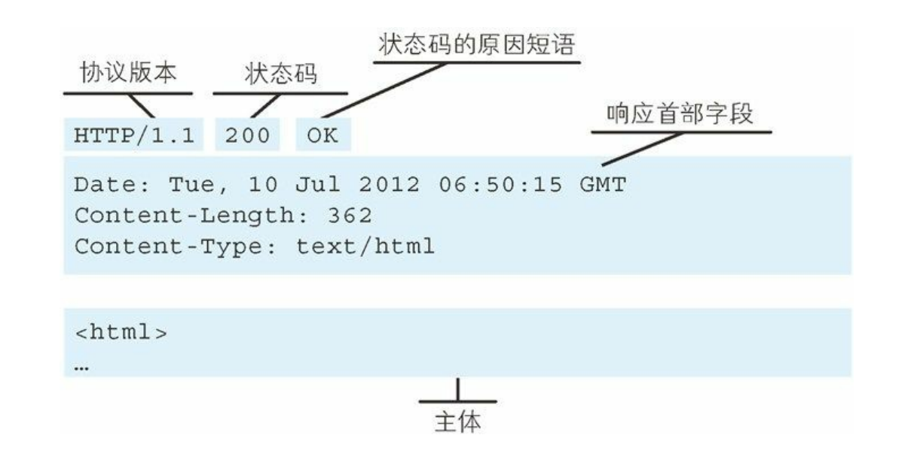

# 2.3 HTTP的特点

+ HTTP是不保存状态的协议，即无状态（stateless）协议。
+ 在HTTP这个级别，自身不对通信状态进行保存


不保存状态在有些时候会产生很多麻烦问题，比如我在某宝买东西，点一个商品我就得重新登录一次。

所以在HTTP1.1版本的时候，引入了Cookie技术。这样一来HTTP就可以管理状态了。

# 2.4 请求URI定位资源

因为URI，在互联网上的任何位置的资源都能被访问到。所以HTTP就可以利用URI去定位资源。

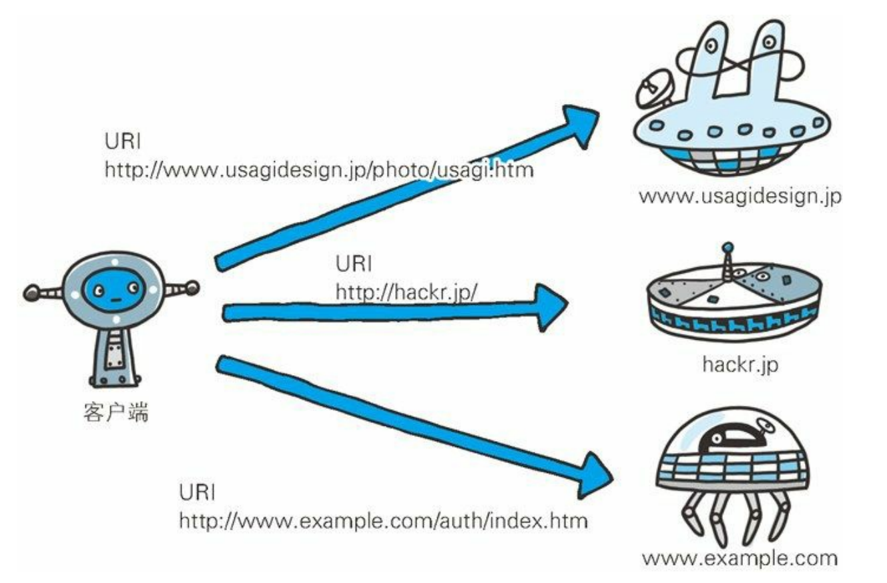

 **那么一个请求中，我该如何使用URI**

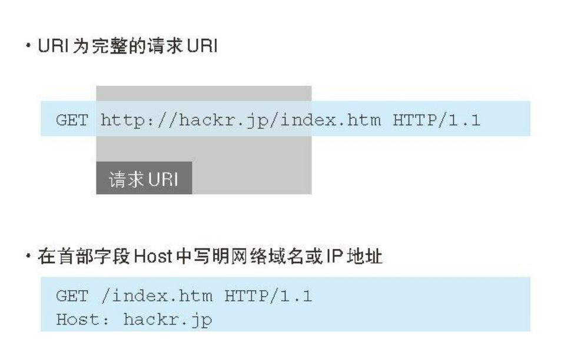

+ 如果针对服务器本身去访问，而不是访问具体的资源，那么可以用*代替URI

  ```HTTP
  OPTIONS * HTTP/1.1
  ```

# 2.5 讲讲HTTP请求里面的方法

表示请求访问服务器的类型称为方法

## GET：获取资源

+ 用来请求已被URI识别的资源。

+ 指定的资源经过服务器端解析后返回响应内容。

**具体实例：**

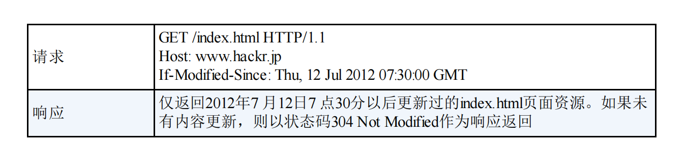

## POST：传输实体主体

POST的主要目的并不是获取响应的主体内容

**具体实例：**

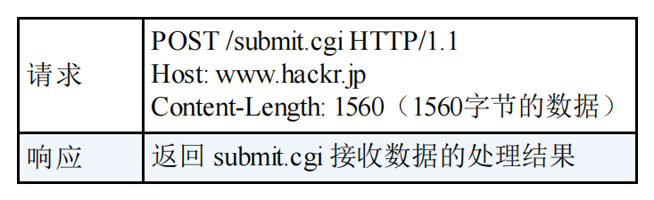

## PUT：传输文件

+ 就像FTP协议的文件上传一样，要求在请求报文的主体中包含文件内容，然后保存到请求URI指定的位置。
+ 但是，HTTP/1.1的PUT方法自身不带验证机制，任何人都可以上传，存在安全性问题。配合其他验证机制使用。

**具体实例：**

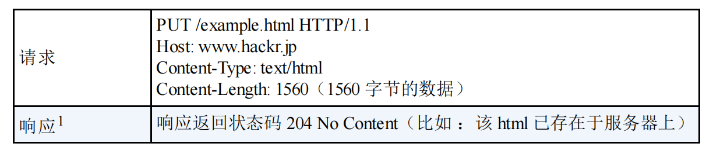

## HEAD：获得报文首部

+ 跟GET方法一样，只是不返回报文主体部分。
+ 用来确认URI的有效性及资源更新的日期时间等。

**具体实例：**

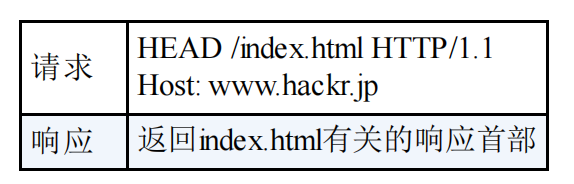

## DELETE：删除文件

+ DELETE方法按请求URI删除指定的资源，与PUT方法相反。
+ 与PUT方法一样，自身不带验证机制。需要配合Web应用程序的验证机制使用。

**具体实例：**

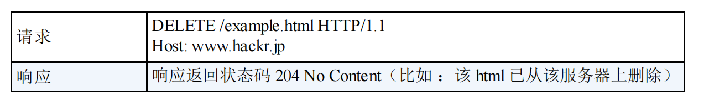

## OPTIONS：询问支持的方法

+ 用来查询针对请求URI指定资源支持的方法

**具体实例：**

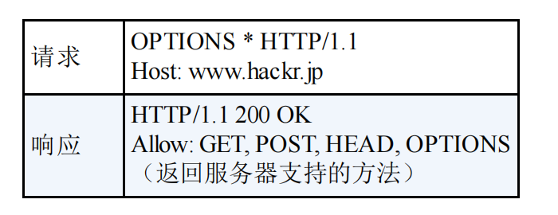

## TRACE：追踪路径

+ 让Web服务器端将之前的请求通信环回给客户端的方法
+ 在Max-Forwards首部字段中填入数值，每经过一个服务器就将该数字减1，当数值刚好减到0的时候，就停止继续传输。
+ 客户端通过TRACE方法可以查询发送出去的请求是怎样被加工修改/篡改的。请求在连接到目标服务器可能会通过代理服务器中转，TRACE方法就是用来确认连接过程中发送的一系列操作。

**具体实例：**

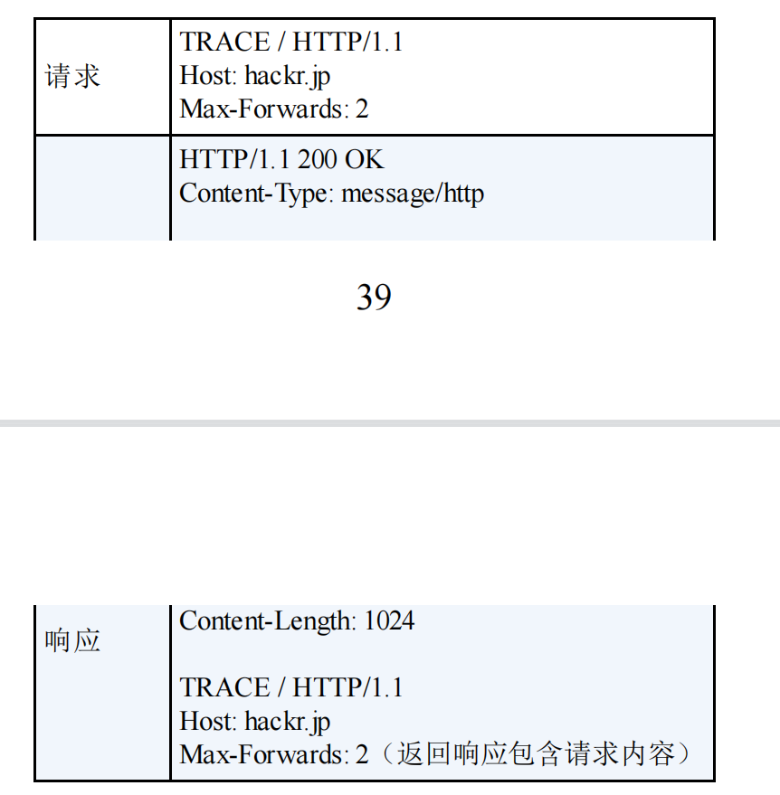

## CONNECT：要求用隧道协议连接代理

+ 要求在与代理服务器通信时建立隧道，实现用隧道协议进行TCP通信。
+ 主要使用SSL和TSL协议把通信内容加密后经过网络隧道传输

格式如下：

```HTTP
CONNECT 代理服务器名:端口号 HTTP版本
```

**具体实例：**

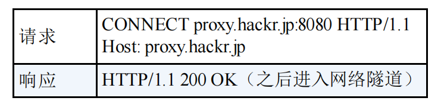

# 2.6 命令&1.0和1.1 支持地方法

向指定资源发送请求报文时，采用的方法就叫命令。

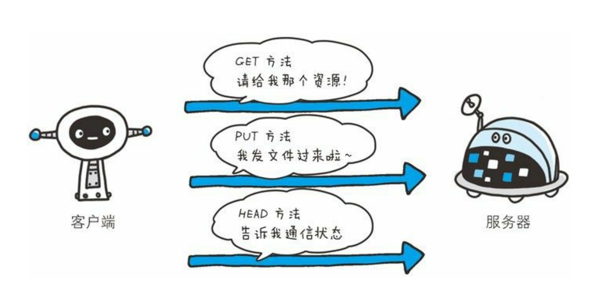

**HTTP/1.0和HTTP/1.1 支持地方法：**

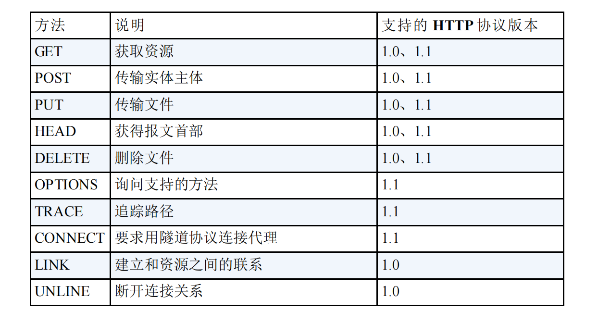

# 2.7 持久连接节省通信量

+ 一开始的HTTP默认为短连接，每进行一次HTTP通信就要断开一次连接。
+ 在一个HTML页面如果有多个图片，那么在访问这个HTML资源的时候就会重复不断地连接建立和断开，必须进行多次通信
+ 速度慢，通信量大

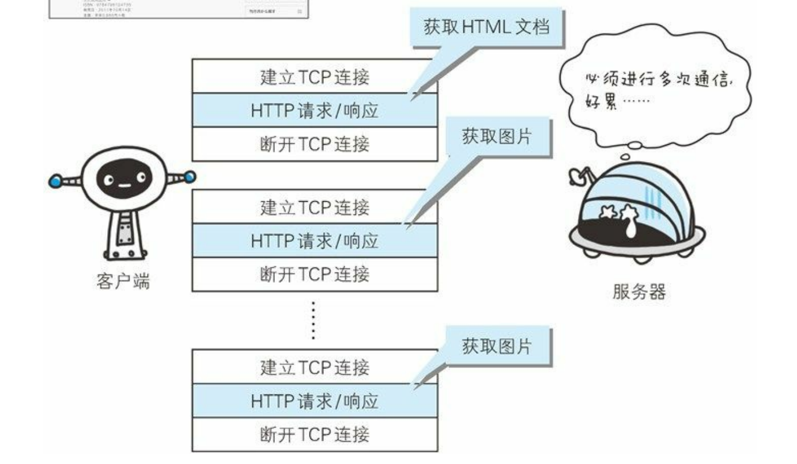

## 2.7.1 持久连接

+ HTTP/1.1默认为长连接，也就是一端如果部主动断开就一直连着。
+ 部分HTTP/1.0 通过字段：Connection:keep-alive要求服务器不关闭TCP连接

**为啥要长连接：**

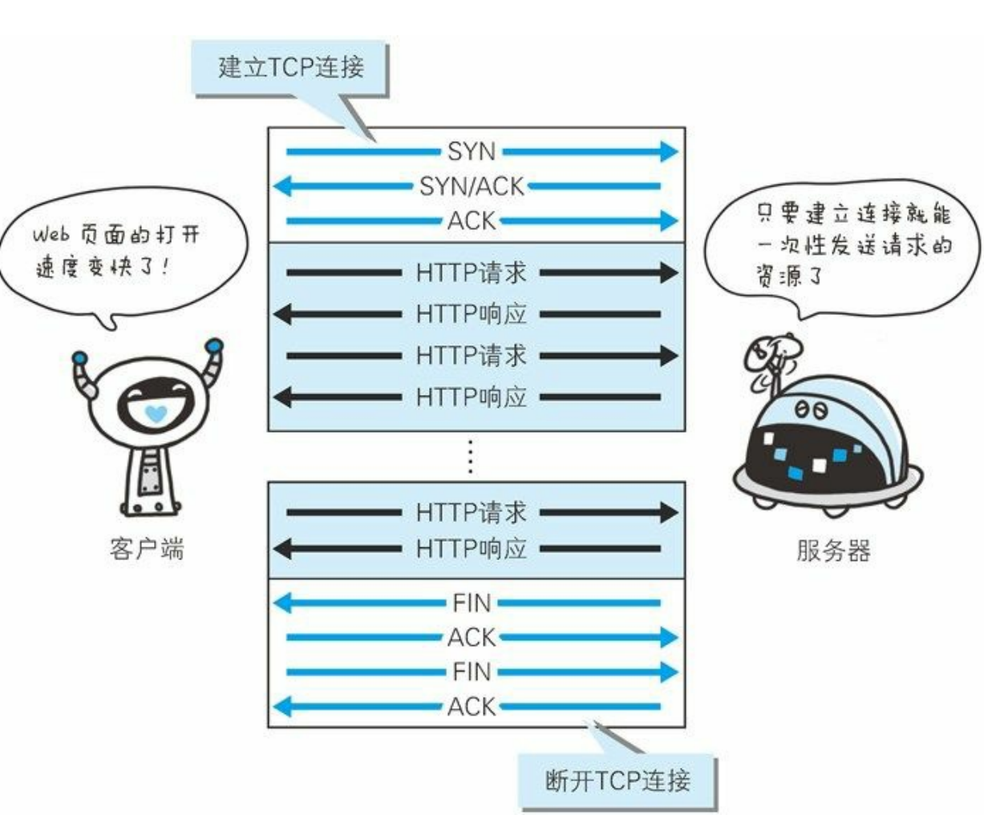

减少了TCP连接地重复建立和断开所造成地额外开销，减轻了服务器端地负载。

HTTP请求和响应能更早结束，Web页面显示速度变快

## 2.7.2 管线化

+ 管线化技术出现后，不用等待响应亦可直接发送下一个请求。

+ 这样就可以做到同时并行发送多个请求，而不需要一个接一个地等待响应。

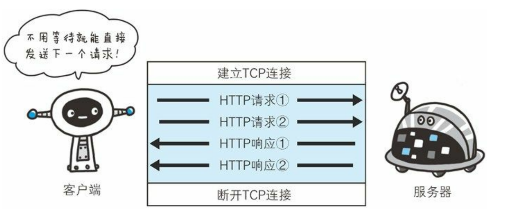

# 2.8 使用Cookie的状态管理

HTTP无状态的优点：减少服务器的CPU及内存资源的消耗。

+ 想要保留无状态协议的这个特征的同时需要解决类似的矛盾问题，所以引入了Cookie技术。
+ 通过在响应和请求报文中写入Cookie信息来控制客户端的状态。

服务端发送Set-Cookie的首部字段信息，客户端保存Cookie。以后客户端再发送请求有这个Cookie，服务器就可以找自己的记录。

**没有Cookie信息状态下的请求：**

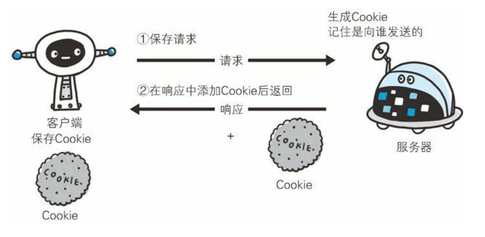

**存有Cookie信息状态的请求：**

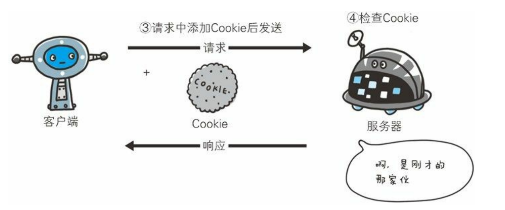

**具体实例：**

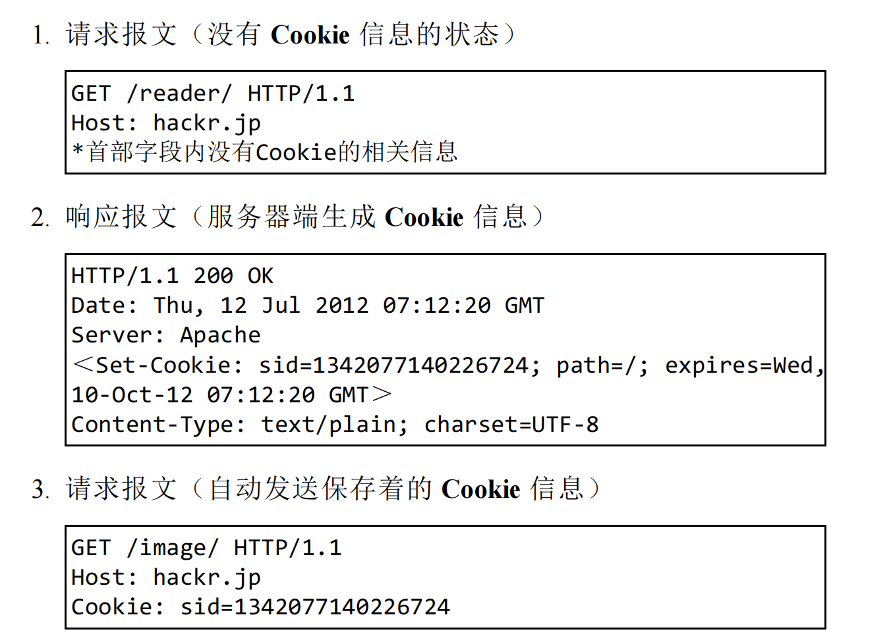
