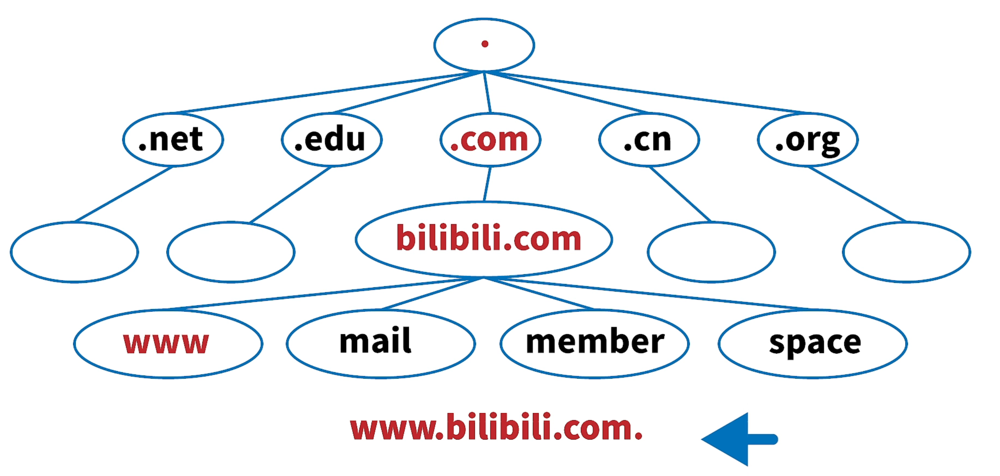
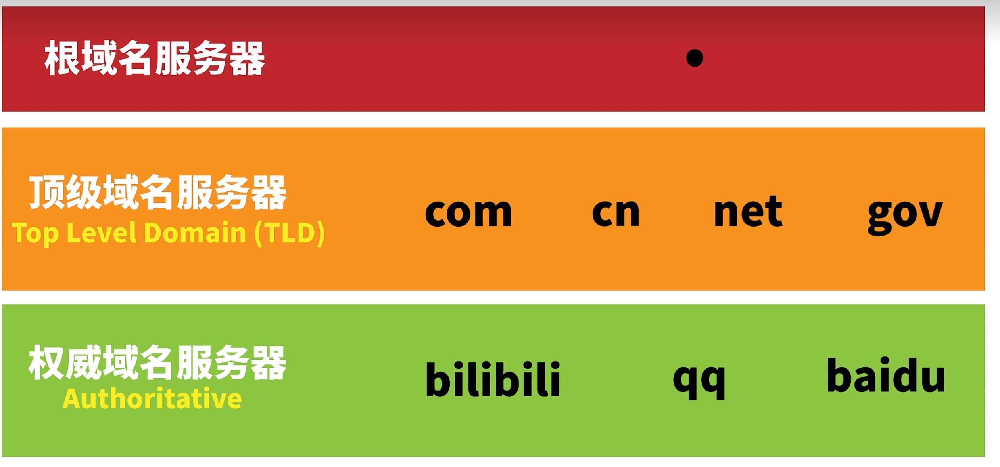
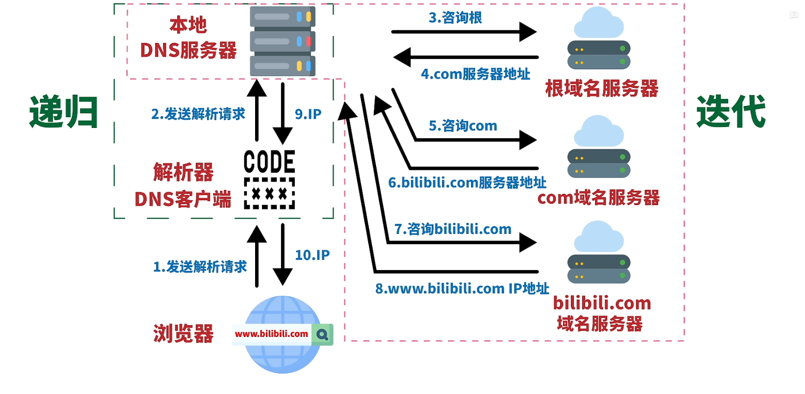

# DNS解析域名的两种方式？

**域名结构树：**

DNS客户端和本地名称服务器是递归，而本地DNS服务器和其他名称服务器之间是迭代。

[DNS域名解析过程详解](https://blog.csdn.net/m0_58196614/article/details/126445467)

# 请求首部字段是干嘛的，有啥用？

为了给浏览器和服务器提供报文主体大小、所使用的语言、认证信息等内容。

[请求首部字段详解-四大首部字段之一 ](https://zhuanlan.zhihu.com/p/90810217)

# GET、POST、HEAD有啥区别？

+ GET 用于获取信息，是无副作用的，是幂等的，且可缓存 
+ POST 用于修改[服务器](https://cloud.tencent.com/product/cvm?from=10680)上的数据，有副作用，非幂等，不可缓存
+ HEAD方法，服务器返回的只是响应标题，而不会返回被请求的文挡，HEAD方法通用于一些搜索引擎中
+ [面试必备：GET和POST 的区别详细解说 - 腾讯云开发者社区-腾讯云 (tencent.com)](https://cloud.tencent.com/developer/article/1498283)

# 隧道协议有什么作用？

简单来说，`隧道技术是一类网络协议`，是将一个数据包封装在另一个数据包中进行传输的技术；**使用隧道的原因是在不兼容的网络上传输数据，或在不安全网络上提供一个安全路径**。通过网络隧道技术，可以使隧道两端的网络组成一个更大的内部网络。（把不支持的协议数据包打包成支持的协议数据包之后进行传输）。

[网络隧道技术_Hermokrates的博客-CSDN博客_隧道技术](https://blog.csdn.net/sinat_24092079/article/details/120676289)

